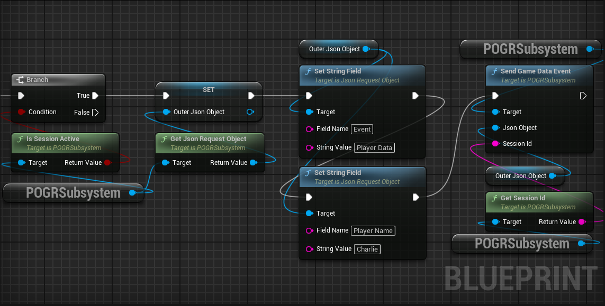
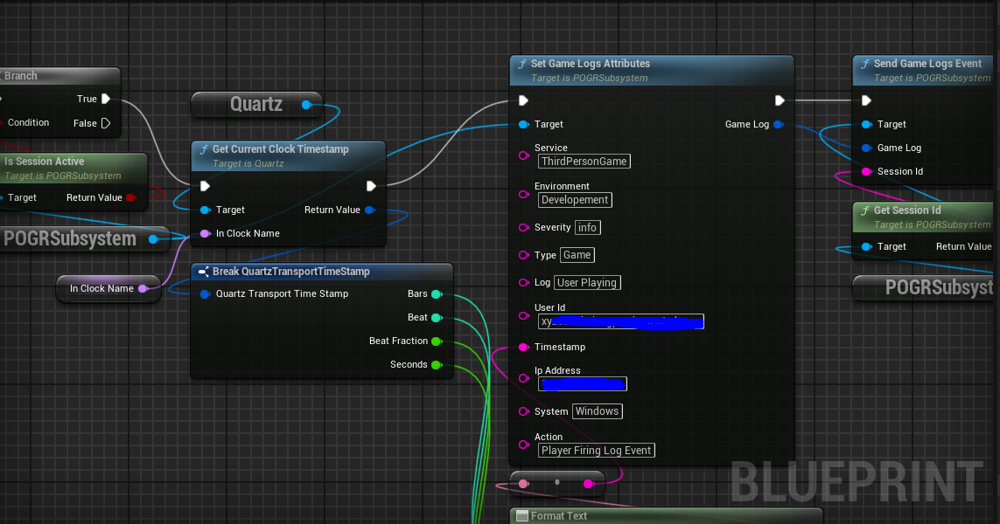

# POGR for Unreal
> The source code in this branch is intended to be used with Unreal Engine 5.2 or latest versions of UE5.
Welcome to the repository for the POGR For Unreal Plugin.

Introduction for the POGR Plugin goes here
* what it is about?
* why we built it?
* what problems it going to address for the users of POGR?

# Features
01. Supports sessions with the backend services of the POGR
02. Supports game programmers/desinger to collect data realted to game such as user specific, metrics, logs, performance, and custom data
03. Supports development cycle by providing user friendly UI to payloads records realted to events, users, metrics, and logs of the game
04. Blueprint friendly
05. Allow developers to communicate seamlessly with the backend of POGR using POGR middleware provided in the repo **POGR**
   
# Installing the plugin
01. In this GitHub repository, click **Releases** on the right side. 
02. Download the POGR Plugin zip file.  
03. Extract the **POGR** folder to the **Plugins Folder** of your Unreal Directory. You can either copy it to Unreal's engine version directory or your Unreal project directory.

    In this example, Unreal's directory location is `C:\Program Files\Epic Games\UE_5.X\Engine\Plugins\Runtime\POGR` and the project directory is `C:\Unreal Projects\YourUnrealEnigneProject\Plugins\POGR`

    **Note: For Unreal Engine 5, you must use Unreal's project directory.** 

## Verify the Plug-in works
Once you install the Houdini Engine plug-in, you can verify it's loaded properly. 

01. Open a new or existing Unreal project. 
02. In the **main menu bar**, you can see **POGR** as a new selection.

# Feedback
Please send bug reports, feature requests and questions to [POGR support](Please Add A link Here)

# Blueprints

Below is the example of how to use this plugin for payload capture in your blueprints/scripts:

